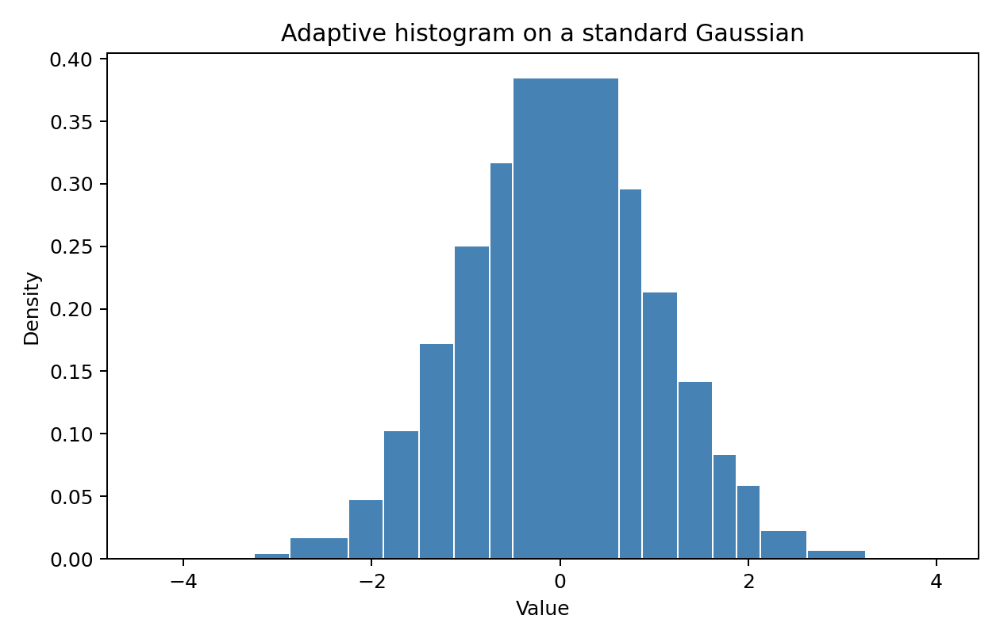
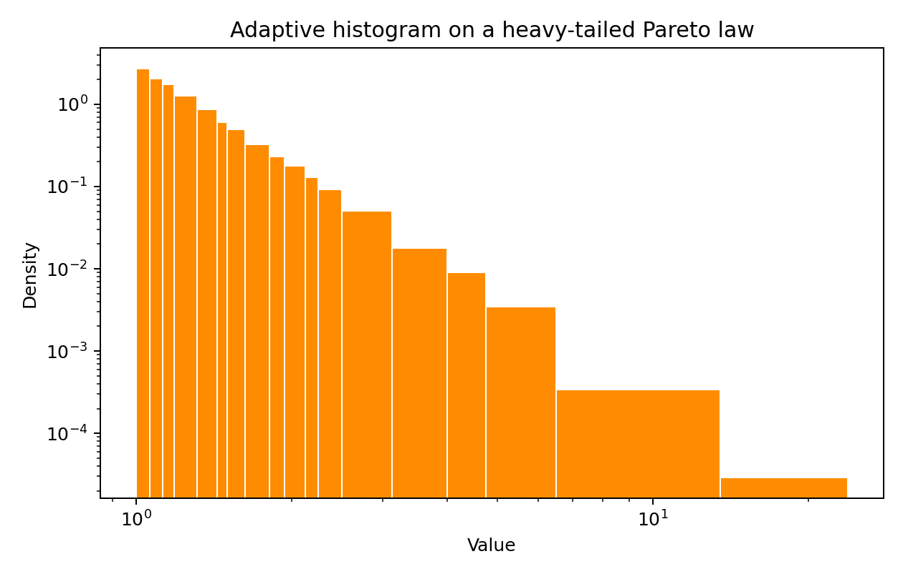

# Khisto

**Optimal Binning Histograms for Python**

Khisto is a Python library for creating histograms using the **Khiops optimal binning algorithm**. Unlike standard histograms that use fixed-width bins or simple heuristics, Khisto automatically determines the optimal number of bins and their variable widths to best represent the underlying data distribution.

## Features

- **Optimal Binning**: Uses the MODL (Minimum Description Length) principle to find the best discretization.
- **Variable-Width Bins**: Captures dense regions with fine bins and sparse regions with wider bins.
- **NumPy Compatible**: Drop-in replacement for `numpy.histogram`.
- **Matplotlib Integration**: `khisto.matplotlib.hist` works like `plt.hist`.
- **Core Histogram API**: Inspect every available granularity with `khisto.core.compute_histograms` and `HistogramResult`.
- **Minimal Dependencies**: Only requires NumPy (matplotlib optional for plotting).

| Standard Gaussian | Heavy-tailed Pareto |
| --- | --- |
|  |  |

## Reproducing The Example Distributions

The complete runnable script is available in `scripts/generate_distribution_examples.py`.

Run it from the repository root to regenerate both example distributions and the figure files used in this README:

```bash
python scripts/generate_distribution_examples.py
```

## Installation

```bash
pip install khisto
```

With matplotlib support:

```bash
pip install "khisto[matplotlib]"
```

## Quick Start

### NumPy-like API

```python
import numpy as np
from khisto import histogram

# Generate 10,000 samples from a standard Gaussian distribution.
data = np.random.normal(0, 1, 10000)

# Compute optimal histogram (drop-in replacement for np.histogram)
hist, bin_edges = histogram(data)

# With density normalization
density, bin_edges = histogram(data, density=True)

# Limit maximum number of bins
hist, bin_edges = histogram(data, max_bins=10)

# Specify range
hist, bin_edges = histogram(data, range=(-2, 2))
```

Using 10,000 samples keeps the adaptive refinement visible while remaining fast to compute.

Heavy-tailed example:

```python
import numpy as np
import matplotlib.pyplot as plt
from khisto.matplotlib import hist

# Generate 10,000 samples from a Pareto distribution, shifted to start at 1 for better log-log visualization
shape = 3
long_tail_data = np.random.pareto(shape, size=10000) + 1

# Plot an adaptive histogram on logarithmic axes.
n, bins, patches = hist(long_tail_data, density=True)
plt.xscale("log")
plt.yscale("log")
plt.show()
```

### Matplotlib Integration

```python
import numpy as np
import matplotlib.pyplot as plt
from khisto.matplotlib import hist

# Generate 10,000 samples from a standard Gaussian distribution.
data = np.random.normal(0, 1, 10000)

# Density is usually the most interpretable view with variable-width bins.
n, bins, patches = hist(data, density=True)
plt.xlabel('Value')
plt.ylabel('Density')
plt.show()

# Cumulative density follows matplotlib semantics.
n, bins, patches = hist(data, density=True, cumulative=True)
plt.ylabel('Cumulative probability')
plt.show()
```

## How It Works

Khisto uses the Khiops optimal binning algorithm based on the MODL (Minimum Optimal Description Length) principle. Instead of using fixed-width bins like traditional histograms, it:

1. Analyzes the data distribution
2. Finds bin boundaries that minimize information loss
3. Creates variable-width bins that adapt to data density

This results in histograms that better represent the underlying distribution, with finer bins in dense regions and wider bins in sparse regions.

The method implemented in Khiops is comprehensively detailed in [2] and further extended in [1].

- [1] M. Boullé. Floating-point histograms for exploratory analysis of large scale real-world data sets. Intelligent Data Analysis, 28(5):1347-1394, 2024
- [2] V. Zelaya Mendizábal, M. Boullé, F. Rossi. Fast and fully-automated histograms for large-scale data sets. Computational Statistics & Data Analysis, 180:0-0, 2023

## Development

```bash
# Clone repository
git clone https://github.com/khiops/khisto-python.git
cd khisto-python

# Install with dev dependencies
uv sync --group dev --extra all

# Run tests
uv run pytest
```

## Documentation

Full documentation is hosted at **[khiops.github.io/khisto-python](https://khiops.github.io/khisto-python/)**.

- [API Reference](https://khiops.github.io/khisto-python/array/histogram/index.html) — NumPy-like histogram API
- [Matplotlib Integration](https://khiops.github.io/khisto-python/matplotlib/index.html) — `hist` plotting function
- [Core API](https://khiops.github.io/khisto-python/core/index.html) — full access to histogram granularity levels
- [API Comparison](https://khiops.github.io/khisto-python/api_comparison.html) — side-by-side with NumPy and Matplotlib
- [Demo Notebook](https://khiops.github.io/khisto-python/demo.html) — interactive walkthrough

## License

[BSD 3-Clause Clear License](LICENSE)
