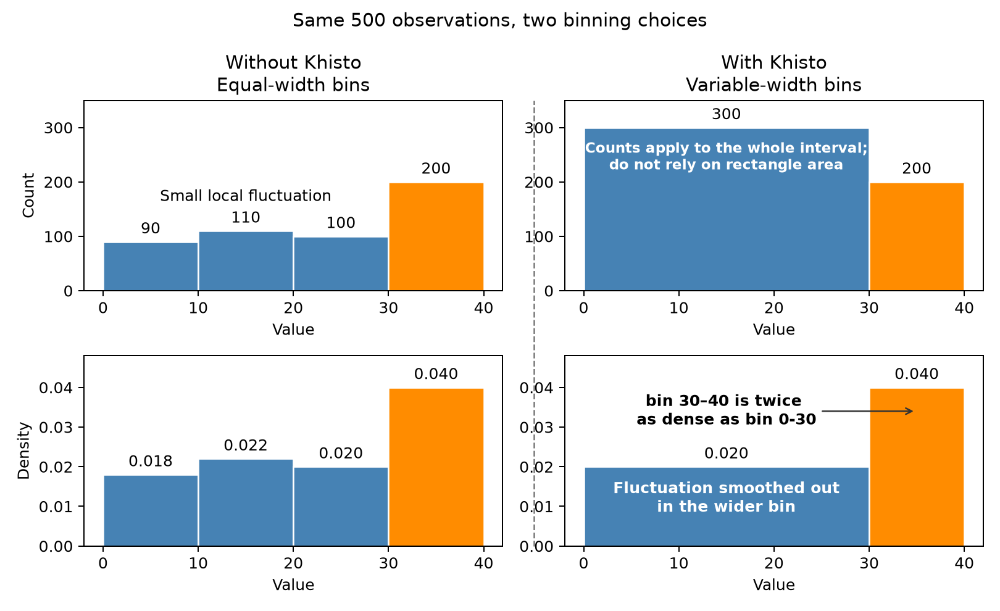

Counts vs Density
=================

Both columns show the same 500 observations with two different binning schemes.
With equal-width bins, counts and density have the same shape. With variable-width
bins, raw counts favor wider intervals and can distort the visual comparison.

With equal-width bins, taller bars indicate a greater probability of falling
within that interval. When bin widths vary, height alone is not enough:
probability is represented by the bar's area, calculated as density multiplied
by bin width.

Note that variable-width bins are ideal for unbalanced distributions and outliers,
as shown in `Histograms - Khiops <https://khiops.org/learn/histograms/>`_.

Reading variable-width histograms
---------------------------------

.. csv-table::
   :header: "Question", "Use", "What to compare"
   :widths: 35, 35, 30

   "How many observations?", "Counts (``density=False``)", "Bar heights"
   "What fraction of observations?", "Counts divided by :math:`N`, or density times bin width", "Bar areas"
   "Where are values concentrated?", "Density (``density=True``, the Khisto default)", "Bar heights"